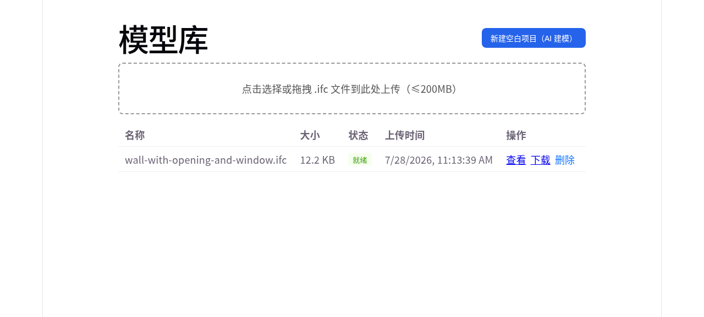
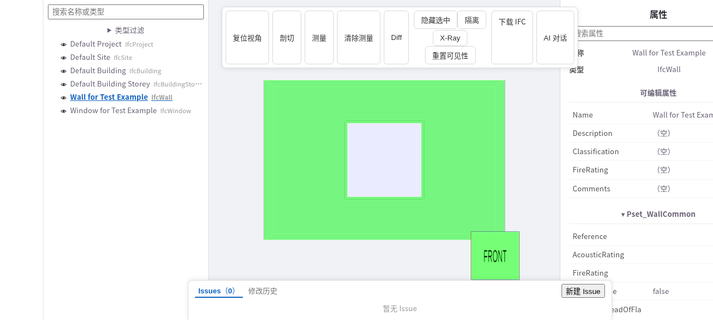
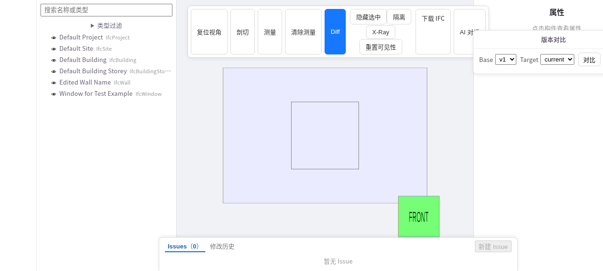
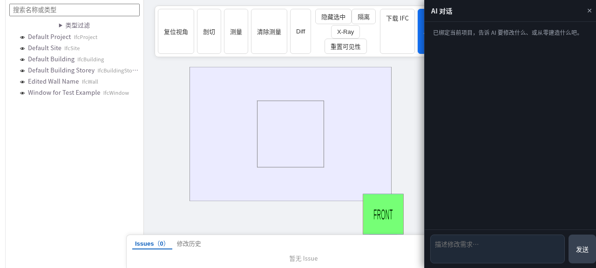

# SourceAEC

[English](README.md)

SourceAEC 是开源、自托管、面向 Agent 的 IFC 操作接口。它通过同一套
script-as-source API，为 Agent 和人提供 IFC 创建、编辑、检查、沙箱执行与语义
版本管理；可选的规划与 DXF 工作流可以作为 IFC 建模的上游输入。

> 文档：<https://0702hjj.github.io/SourceAEC/>

## 核心能力

- 面向 Agent 的 IFC 创建与编辑 REST API 和 Skill。
- 基于 IfcOpenShell、以可审查 Python 脚本为模型事实源的执行环境。
- 可选的规划与 CAD/DXF 制图能力，以及浏览器二维查看器。
- Python 构建脚本是模型唯一事实源。
- 沙箱试运行与不可变版本快照。
- 按 IFC GlobalId 的属性级语义对比。
- React 前端、Go 网关和两个对等的 Python 编辑服务。
- 进程内 AI agent；未配置 API key 时使用确定性离线模型。

## 架构

```text
浏览器（React、xeokit/web-ifc、Fabric）
        |
        v
Go 网关 :8090 ----> IFC 服务 :8100 ----> IfcOpenShell
        |            CAD 服务 :8200 ----> ezdxf
        |                     |
        +----> converter      +----> 共享沙箱与编辑 API 包
        +----> 进程内 AI agent
```

## 界面

| 模型库 | IFC 属性 |
|---|---|
|  |  |

| 版本对比 | AI 对话 |
|---|---|
|  |  |

## 快速开始

需要 Go 1.26、Node.js 22、Python 3.10、`uv`，以及 Linux 上的 bubblewrap。
生产环境缺少 bubblewrap 时，脚本执行会 fail-closed。

```bash
cd converter && npm install
cd ../web && npm install
cd ../services/ifc && uv sync
cd ../cad && uv sync
```

分别启动两个 Python 服务、Go 网关和 Vite 开发服务器：

```bash
# 终端 1
cd services/ifc
VIEWER_DATA_DIR="$(realpath -m ../../data)" uv run uvicorn app.main:app --port 8100

# 终端 2
cd services/cad
VIEWER_DATA_DIR="$(realpath -m ../../data)" uv run uvicorn app.main:app --port 8200

# 终端 3
cd server && go run ./cmd/server

# 终端 4
cd web && npm run dev
```

两个 Python 服务和 Go 网关必须使用同一个绝对数据目录。`VIEWER_LLM_API_KEY`
为空时，agent 使用确定性离线模型。

## 仓库结构

```text
web/               React 前端
server/            Go REST 网关与进程内 agent
converter/         IFC 到 XKT 转换器
services/ifc/      IFC 编辑服务
services/cad/      CAD 编辑服务
services/sandbox/  共享沙箱运行时
services/editapi/  共享脚本编辑 API
mcp/               可选 MCP 桥
skills/             Agent 建模与规划 Skill
tools/              打包与 agent 调试工具
examples/           合成示例
```

## 开发验证

修改哪个组件，就运行对应套件。主要命令：

```bash
cd web && npm test && npm run lint && npm run build
cd server && go test ./... && go vet ./...
cd converter && npm test
cd services/ifc && uv run --group dev pytest
cd services/cad && uv run --group dev pytest
cd services/sandbox && uv run --group dev pytest
cd mcp && uv run --group dev pytest
scripts/check_file_size.sh
scripts/check_public_snapshot.sh
```

提交 PR 前请阅读 [CONTRIBUTING.md](CONTRIBUTING.md)。

文档随源码维护：

```bash
cd docs
npm install
npm run docs:dev
npm run docs:build
```

## 开发来源声明

SourceAEC 是基于公开技术标准、有文档记录的开源接口、公开调研，以及维护者独立
编写的功能与设计规格所完成的独立实现。其实现由 AI 编码代理通过经审查的 Pull
Request 逐步完成。任何第三方的私有或保密仓库、源代码、内部文档、客户数据、
图纸或其他非公开技术材料，均未被提供给这些代理、用作实现输入或复制到本项目中。
仓库历史和 Pull Request 保留了开发过程记录。

所有贡献都必须具有可说明的合法来源。贡献者须确认其有权提交相关内容，披露所含
第三方材料及其许可证，并且不得提交保密信息或商业秘密。DCO 签署和来源要求详见
[CONTRIBUTING.md](CONTRIBUTING.md)。如认为仓库中的材料侵犯了你的合法权益，请
通过 Issue 或私密渠道提供受影响的路径和权利依据，以便及时调查处理。不要在公开
Issue 中披露保密材料或个人数据；如可用，应优先使用 GitHub 私密安全报告或私下联系
维护者。

## 使用边界与保证

SourceAEC 是开发者工具和参考实现，不是安全关键、法定审查、测绘或施工审批系统。
生成的 IFC/DXF 内容、AI 建议、转换结果和沙箱结果，在用于设计、采购、施工、运行
或合规决定前，必须由具备相应资质的人员独立复核。本项目不承诺输出准确、适用于某
一特定用途、能够与所有下游工具互操作、符合任何法律或标准，或不涉及第三方权利
主张。适用的保证和责任边界以 Apache-2.0 许可证及所含依赖的许可证/声明为准。

## 许可证

SourceAEC 主体采用 Apache-2.0。`skills/aiplan` 与 `skills/aidxf` 目录默认采用
MIT；单个文件的 SPDX 标识优先于目录默认许可。第三方运行时见 [NOTICE](NOTICE)。
前端依赖 AGPL-3.0 的 xeokit，仓库内的 web-ifc WASM 文件仍受 MPL-2.0 约束。
